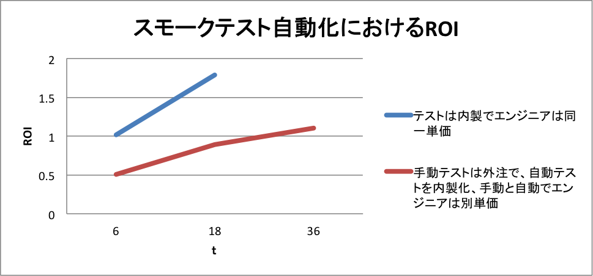
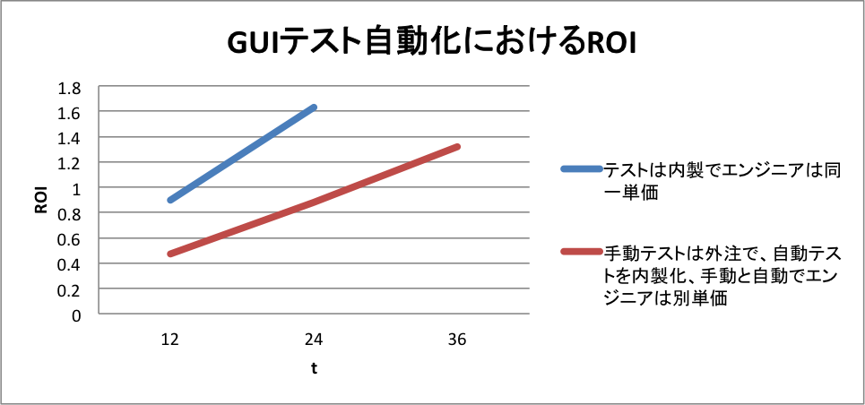

# ROIの試算式の詳細と実際

今回はROIの試算式の詳細を解説し、実際にこの試算式でスモークテストとGUIテストの自動化のROIを求めてみます。

## 試算式の構成要素の詳細な解説

前回で Cost Benefits Analysis of Test Automation の下記の試算式を紹介しました。

ROI(t) = Δ手動テストに対するテスト自動化の利益 / Δ手動テスト対するテスト自動化のコスト = ΔB(t) / ΔC(t)

ΔB(t) = Σ(自動テストによる固定費の削減分)(t) + Σ(n2回手動テストを実施した場合の変動費)(t) - Σ(n1回自動テストを実施した場合の変動費)(t)

ΔC(t) = Σ(自動テストによる固定費の増加分)(t) + Σ(自動テストの開発費) - Σ(手動テストの開発費) + Σ(自動テストのメンテナンスコスト) (n1/N)

n1 = 自動テストの実行回数

n2 = 手動テストの実行回数

N = メンテナンスが必要になるまでの自動テストの平均実行回数

各要素を順に見ていきましょう。

「自動テストによる固定費の削減分」とはテストの実行回数に依存しないテスト計画やテスト設計など、手動テストと自動テストで共通に発生するコストで改善された差分です。逆に自動テストのために精緻化したテスト設計が必要になり、追加コストが必要になりマイナスになる場合もあります。第2回で解説したように、これらは自動テストの場合、手動テストより精緻化する必要があるため、自動化に移行する際に一時的にはコストは上昇しますが、長期的には精緻化によって発生するプロセス改善効果によるコスト削減で相殺されることが多いため、最初の試算では期間 t 内で合算して0にする場合が多いです。

手動テストと自動テストで実行回数を n2 と n1 で分けているのは通常、自動テストの実行の方が1回あたりのコストとかかる実行時間が短く、実行頻度が異なるためです。手動テストの場合は実行コストが高いため、テスト対象アプリケーションのビルド毎にテストを実行するのは難しいですが、自動テストの場合、実行コストが低いため、頻度を上げて素早く、障害を検出することができます。

注意しなければならないのは N のメンテナンスが必要になるまでの自動テストの平均実行回数です。自動テストのテストレベルやテストタイプにもよりますが、対象アプリケーションの画面要素やロジックの変化により、テストスクリプトの修正が必要になるため、最悪 N = 1 の自動テストの実行毎にメンテナンスコストが発生する場合があります。画面要素の変更に対して、N を上げる技術としては、物理的な画面要素を論理名にマッピングするオブジェクトマップがあります。テストツールにも依りますが、オブジェクトマップでは単純に物理要素を論理名にマッピングするだけなく、物理要素の指定の仕方を複数の指定方法 (HTMLであれば、id, name, classなど) で重み付けすることによって、画面要素に多少の変更があってもテストスクリプトはもちろんのこと、オブジェクトマップの変更も不要になります。一方、 N ごとのメンテナンスコストを下げる技術としては、ページオブジェクトを始めとするテストスクリプトの構造化、データ駆動化、キーワード駆動テストなどがあります。

「自動テストによる固定費の増加分」はテストツールのライセンスやサポートなど手動テストでは発生しない自動テストを導入した場合のコストです。ライセンス期間やアップグレードのコストがあるため、時間 t の関数になります。

「手動テストの開発費」は手動テストを続けた場合にかかっていたであろうコストで、これをマイナスすることにより、手動テストに対する自動テストの相対的な初期投資を算出しています。

第2回で解説したように固定費と変動費は更に詳細な要素に分解することもできますが、詳細に分解しない合算値からでもある程度妥当性があるものが出せると  Cost Benefits Analysis of Test Automation では述べています。筆者もまずは手動テストの単価計算に基づいた概算でも良いので算出できる要素から ROI を試算し、複数の施策を比較検討することをお勧めします。

## スモークテスト自動化におけるROIの試算

### テストは内製でエンジニアは同一単価

先ほどの式を使って、下記のような仮定でスモークテスト(ビルド後に実行するテストを開始すべきかどうか判断するためのテストで、極力短い時間で重要な機能をテストするように絞り込まれているテスト)自動化の ROI を求めてみましょう。

* 1日に1回ビルドを実施し、テストを実行します (週に5回)
* 手動テストでは設計に5日、実行に2時間かかります
* 手動テストは半分のみを1日1時間で実行し、残り半分を次の日に1時間実行します (ビルド毎には半分しか実行しません)
* 自動テストは設計と実装に15日かかり、実行は自動であるため、コストゼロとします
* 自動テストには10万円の追加ハードウェアが必要で、減価償却期間は3年とします
* 自動テストは25回の実行に1回、1日のメンテナンスが必要です
* 試算対象期間 t としては6ヶ月(125日)と18ヶ月(375日)を選びます
* 手動テスト、自動テストのいずれのエンジニアの単価も80万円/月、960万円/年、4万円/日、5,000円/時とします

#### 利益

ΔB(t) = Σ(自動テストによる固定費の削減分)(t) + Σ(n2回手動テストを実施した場合の変動費)(t) - Σ(n1回自動テストを実施した場合の変動費)(t)

Σ(自動テストによる固定費の削減分)(t) = なし

Σ(n2回手動テストを実施した場合の変動費)(t) = 1時間あたりのエンジニアの単価 * 手動テストの1日の実行時間 * 日数

Σ(n1回自動テストを実施した場合の変動費)(t) = 自動テストの実行コスト * 日数

具体的な値を代入すると

ΔB(6ヶ月) = 0 + (5,000 * 1 * 125) - (0 * 125) = 5,000 * 125 = 625,000 (円)

ΔB(18ヶ月) = 0 + (5,000 * 1 * 375) - (0 * 375) = 5,000 * 375 = 1,875,000円 (円)

#### コスト

ΔC(t) = Σ(自動テストによる固定費の増加分)(t) + Σ(自動テストの開発費) - Σ(手動テストの開発費) + Σ(自動テストのメンテナンスコスト) (n1/N)

Σ(自動テストによる固定費の増加分)(t) = 3年間のハードウェアのコスト * (経過年数 / 3) = 3年間のハードウェアのコスト * (経過月数 / 36)

Σ(自動テストの開発費) = 自動テストの設計と実装の日数 * 1日あたりのエンジニアの単価

Σ(手動テストの開発費) = 手動テストの設計と実装の日数 * 1日あたりのエンジニアの単価

Σ(自動テストのメンテナンスコスト) = 1日あたりのエンジニアの単価 * 自動テストの実行日数 / メンテナンスが必要になるまでの自動テストの平均実行回数 

具体的な値を代入すると

ΔC(6ヶ月) = 100,000 * (6/36) + 15 * 40,000 - (5 * 40,000) + 40,000 * (125/25) = 616,666 (円)

ΔC(18ヶ月) = 100,000 * (18/36) + 15 * 40,000 - (5 * 40,000) + 40,000 * (375/25) = 1,050,000 (円)

#### ROI

ROI(6ヶ月) = 625,000 / 616,666 =  1.013 (損益分岐点)

ROI(18ヶ月) = 1,875,000 / 1,050,000 = 1.786 (80%リターン)

### 手動テストは外注で、自動テストを内製化、手動と自動でエンジニアは別単価

手動テストの実行を外注していると仮定し、下記のように条件を変更して再度 ROI を求めてみましょう。

* 手動テストの設計と自動テスト設計・実装のエンジニアの単価は80万円/月、960万円/年、4万円/日、5,000円/時のままとします
* 手動テストの実行エンジニアの単価を40万円/月、480万円/年、2万円/日、2,500円/時に変更します
* 試算対象期間 t としては36ヶ月(750日)を追加します

#### 利益

ΔB(6ヶ月) = 0 + (2,500 * 1 * 125) - (0 * 125) = 2,500 * 125 = 312,500 (円)

ΔB(18ヶ月) = 0 + (2,500 * 1 * 375) - (0 * 375) = 2,500 * 375 = 937,500円 (円)

ΔB(36ヶ月) = 0 + (2,500 * 1 * 750) - (0 * 375) = 2,500 * 750 = 1,875,500円 (円)

#### コスト

ΔC(6ヶ月) = 100,000 * (6/36) + 15 * 40,000 - (5 * 40,000) + 40,000 * (125/25) = 616,666 (円)

ΔC(18ヶ月) = 100,000 * (18/36) + 15 * 40,000 - (5 * 40,000) + 40,000 * (375/25) = 1,050,000 (円)

ΔC(36ヶ月) = 100,000 * (36/36) + 15 * 40,000 - (5 * 40,000) + 40,000 * (750/25) = 1,700,000 (円)

### ROI

ROI(6ヶ月) = 312,500 / 616,666 = 0.507 (投資期間)

ROI(18ヶ月) = 937,500 / 1,050,000 = 0.89 (損益分岐点に達しない)

ROI(36ヶ月) = 1,875,500 / 1,700,000 = 1.103 (11%リターン)

手動テストの実行コストが低い場合、自動化をしても、3年でようやく10%リターンとなります。

日本でなかなかテスト自動化が進まないのは、自動テストが適用可能な領域が限られていることが理由として挙げられることが多いです。上記の結果から、それ以外にも、エンジニアの単価の観点から、テスト自動化はオフショアやニアショアなどの他のコスト低減策に対して、ROI が良くない場合があるというのも理由の一つになることが分かります。一方手動テスト、自動テストの区別にかかわらず、エンジニアのコストが高いアメリカでは実行コストを下げるために、オフショアと自動テストの ROI 投資効率比較をして結果として国内でのテスト自動化が選ばれると考えられます。

第2回で解説した Risk Reduction ROI Method のように欠陥対応コストを盛り込めば、ROI の試算値は向上しますが、実測値と大きく乖離する場合があるので注意しましょう。

## GUIテスト自動化におけるROIの試算

### テストは内製でエンジニアは同一単価

次に下記の条件で GUI テスト自動化における ROI を求めてみましょう。

* 新規のソフトウェアでテストも一から作成します
* 手動テストの開発には5人/年、自動テストの開発には15人/年かかります
* 自動テストでは1年後に1人/年のメンテナンスが発生します
* 手動テストの実行では10人/年のフルタイムのメンバーが、自動テストでは1人/年のメンバーが必要です
* 自動テストではオープンソースの無料ツールを使い、ハードウェア分の90万円の固定費が減価償却3年で必要です
* 試算対象期間 t としては12ヶ月(250日)と24ヶ月(500日)を選びます
* 手動テスト、自動テストのいずれのエンジニアの単価も80万円/月、960万円/年、4万円/日、5,000円/時とします

#### 利益

ΔB(t) = Σ(自動テストによる固定費の削減分)(t) + Σ(n2回手動テストを実施した場合の変動費)(t) - Σ(n1回自動テストを実施した場合の変動費)(t)

Σ(自動テストによる固定費の削減分)(t) = なし

Σ(n2回手動テストを実施した場合の変動費)(t) = 1年あたりに必要な手動テスト実行の人数 *  エンジニアの1年あたりの単価 * 年数

Σ(n1回自動テストを実施した場合の変動費)(t) = 1年あたりに必要な自動テスト実行の人数 *  エンジニアの1年あたりの単価 * 年数

具体的な値を代入すると

ΔB(12ヶ月) = 0 + (10 * 9,600,000 * 1)  - (1 * 9,600,000 * 1) = 86,400,000　(円)

ΔB(24ヶ月) = 0 + (10 * 9,600,000 * 2)  - (1 * 9,600,000 * 2) = 172,800,000 (円)

#### コスト

ΔC(t) = Σ(自動テストによる固定費の増加分)(t) + Σ(自動テストの開発費) - Σ(手動テストの開発費) + Σ(自動テストのメンテナンスコスト) (n1/N)

Σ(自動テストによる固定費の増加分)(t) = 3年間のハードウェアのコスト * (経過年数 / 3)

Σ(自動テストの開発費) = 1年あたりに必要な自動テストのエンジニアの人数 * 1年あたりのエンジニアの単価

Σ(手動テストの開発費) = 1年あたりに必要な手動テストのエンジニアの人数 * 1年あたりのエンジニアの単価

Σ(自動テストのメンテナンスコスト) = 1年後に発生する自動テストのメンテナンスコスト = 1年後のメンテナンスに必要なエンジニアの人数 * 1年あたりのエンジニアの単価

具体的な値を代入すると

ΔC(12ヶ月) = (900,000 * (1/3)) + (15 * 9,600,000) - (5 * 9,600,000) + 0 = 96,300,000 (円)

ΔC(24ヶ月) = (900,000 * (2/3)) + (15 * 9,600,000) - (5 * 9,600,000) + 1 * 9,600,000 = 106,200,000 (円)

#### ROI

ROI(12ヶ月) = 86,400,000 / 96,300,000 = 0.897 (損益分岐点に達しない)

ROI(24ヶ月) = 172,800,000 / 106,200,000 = 1.627 (63%リターン)

### 手動テストは外注で、自動テストを内製化、手動と自動でエンジニアは別単価

スモークテストの時と同じように手動テストの実行を外注していると仮定し、下記のように条件を変更して再度 ROI を求めてみましょう。

* 手動テストの設計のエンジニアの単価は80万円/月、960万円/年、4万円/日、5,000円/時のままとします
* スモークテストの時よりも自動テストの設計･実装に高いスキルが必要になると仮定し、自動テストのエンジニアの単価は100万円/月、1200万円/年、5万円/日、6250円/時に変更します
* スモークテストの時よりも手動テストの実行と分析、報告に高いスキルが必要になると仮定し、手動テストの実行エンジニアの単価を60万円/月、720万円/年、3万円/日、3750円/時に変更します
* 試算対象期間 t としては36ヶ月(750日)を追加します

#### 利益

ΔB(12ヶ月) = 0 + (10 * 7,200,000 * 1)  - (1 * 9,600,000 * 1) = 62,400,000 (円)

ΔB(24ヶ月) = 0 + (10 * 7,200,000 * 2)  - (1 * 9,600,000 * 2) = 124,800,000 (円)

ΔB(36ヶ月) = 0 + (10 * 7,200,000 * 3)  - (1 * 9,600,000 * 3) = 187,200,000 (円)

#### コスト

ΔC(12ヶ月) = (900,000 * (1/3)) + (15 * 120,000,000) - (5 * 9,600,000) + 0 = 132,300,000 (円)

ΔC(24ヶ月) = (900,000 * (2/3)) + (15 * 120,000,000) - (5 * 9,600,000) + 9,600,000 = 142,200,000 (円)

ΔC(36ヶ月) = (900,000 * (3/3)) + (15 * 120,000,000) - (5 * 9,600,000) + 9,600,000 = 142,500,000 (円)

#### ROI

ROI(12ヶ月) = 62,400,000 / 132300,000 = 0.472 (投資期間)

ROI(24ヶ月) = 124,800,000 / 142,200,000 = 0.878 (損益分岐点に達しない)

ROI(36ヶ月) = 187,200,000 / 142,500,000 = 1.317 (32%リターン)

この条件ではスモークテストよりテストレベルが上がるため、手動テストの実行エンジニアの単価を上げると同時に、自動テストの設計、実装も難易度が上がると仮定し、内製の自動テストのエンジニアの単価も上げました。エンジニアの単価の変更に伴い ROI と損益分岐点が大きく変化しています。この結果から、特に人件費の高い先進国ではツールやハードウェアのコストよりも人件費が ROI に大きく影響を与えることが分かると思います。逆にツールやハードウェアへの投資が人件費の削減に繋がるのでしたら積極的に投資した方が ROI が高まるともいえます。

# まとめ

本連載では テスト自動化で ROI を試算する理由から、テスト自動化の ROI の構成要素と複数の試算式、そして試算の実際を解説してきました。テスト自動化に限らず、ソフトウェア開発では様々な外部要素や変動要素が絡むため、精確な ROI を求めるのは難しいですが、今回の試算の例でも分かるように簡易的な試算であれば最小限の構成要素から試算することができます。テスト自動化の提案や企画の際の定量的な交渉条件として、本連載で学んだ様々な ROI の試算式を読者の皆様が活用して頂けることを楽しみにしています。
